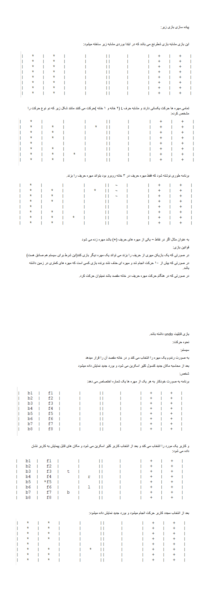

# **♟ Java Chess Board Game Project | پروژه‌ی بازی شطرنج با جاوا**

**A university project in which a chess-like game is designed with Java language.**

**یک پروژه دانشگاهی که در آن یک بازی شطرنج‌مانند با زبان جاوا طراحی میشود.**

# 💬 **نکات پروژه**

* عکس‌های برنامه در دایرکتوری ScreenShots قرار دارند.
* برای اجرا برنامه، به Java JDK 16 و یا بالاتر نیاز دارید.
* برای دسترسی به همه‌ی پروژه‌های دانشگاهی من، به این لینک مراجعه کنید:

👈🏻 **[پروژه‌های دانشگاهی من](https://github.com/bestmahdi2/Uni__Bachelors_SKU_Path)**

# 📝 **توضیحات پروژه**

# 🖼 **عکس‌های پروژه**

  
  
  
  
  
  
  

